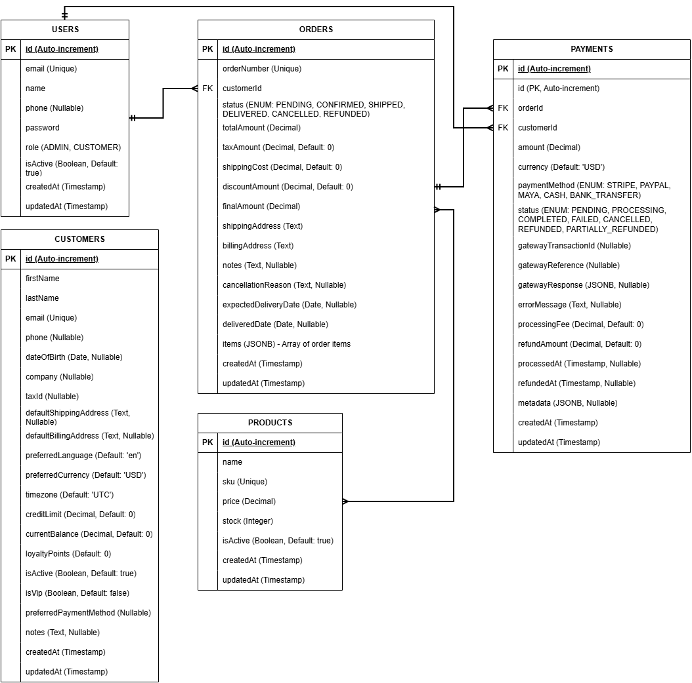

# ERP Backend System

A comprehensive Enterprise Resource Planning (ERP) backend system built with NestJS, TypeScript, and PostgreSQL. This system provides a complete business management solution with user authentication, product catalog management, customer relationship management, order processing, and multi-gateway payment processing capabilities.

## 📋 Program Description

This ERP backend system is designed to handle the core business operations of an e-commerce or retail business. It provides:

- **User Management**: Role-based authentication system with ADMIN and CUSTOMER roles
- **Product Catalog**: Complete inventory management with stock tracking and SKU management
- **Customer Management**: Comprehensive customer profiles with loyalty points and credit management
- **Order Processing**: Full order lifecycle from creation to delivery with status tracking
- **Payment Processing**: Multi-gateway payment support (Stripe, PayPal, Maya) with refund capabilities
- **Business Analytics**: Real-time dashboard with sales analytics and business intelligence
- **Real-time Notifications**: WebSocket-based live updates for order and payment status changes

The system is built with enterprise-grade architecture, featuring secure authentication, comprehensive validation, and scalable database design.

## 🚀 Features

### Core Modules
- **Authentication & Authorization**: JWT-based auth with role-based access control
- **Product Management**: CRUD operations, inventory tracking, stock management
- **Customer Management**: Customer profiles, loyalty points, credit management
- **Order Management**: Order processing, status tracking, order lifecycle management
- **Payment Processing**: Multiple payment gateways (Stripe, PayPal, Maya), refund handling

### Technical Features
- **Database**: PostgreSQL with TypeORM for data persistence
- **Authentication**: JWT tokens with role-based access control
- **Validation**: Comprehensive input validation with class-validator
- **Error Handling**: Structured error responses and logging
- **API Documentation**: RESTful API with comprehensive endpoints
- **Security**: Password hashing, CORS configuration, input sanitization
- **Real-time**: Socket.IO WebSocket connections for live notifications
- **Analytics**: Comprehensive business intelligence and reporting
- **Dashboard**: Real-time business metrics and insights

## 🛠️ Tech Stack

### Backend
- **Framework**: NestJS (v11.0.1) - Enterprise-grade Node.js framework
- **Language**: TypeScript (v5.7.3) - Type-safe JavaScript
- **Runtime**: Node.js (v18+) - JavaScript runtime
- **HTTP Server**: Express.js - HTTP server (via NestJS platform)

### Database & ORM
- **Database**: PostgreSQL (v12+) - Primary relational database
- **ORM**: TypeORM (v0.3.27) - Object-Relational Mapping
- **Driver**: pg (v8.16.3) - PostgreSQL driver
- **Alternative**: SQLite3 (v5.1.7) - Development database

### Authentication & Security
- **JWT**: jsonwebtoken (v9.0.2) - JSON Web Tokens
- **Passport**: passport (v0.7.0) + passport-jwt (v4.0.1) - Authentication middleware
- **Hashing**: bcryptjs (v3.0.2) - Password hashing
- **Validation**: class-validator (v0.14.2) + class-transformer (v0.5.1)

### Payments
- **Stripe**: stripe (v19.1.0) - Payment gateway integration
- **PayPal**: Configured for PayPal integration
- **Maya/PayMongo**: Philippine payment gateway support

### Real-time Communication
- **WebSockets**: Socket.IO - Real-time bidirectional communication
- **NestJS WebSockets**: @nestjs/websockets (v11.1.6) + @nestjs/platform-socket.io (v11.1.6)

### Development & Testing
- **Testing**: Jest (v30.0.0) + Supertest (v7.0.0) + ts-jest (v29.2.5)
- **Linting**: ESLint (v9.18.0) + Prettier (v3.4.2)
- **CLI**: @nestjs/cli (v11.0.0) - NestJS command-line interface
- **TypeScript**: ts-node (v10.9.2) + ts-loader (v9.5.2)

### Configuration & Environment
- **Config**: @nestjs/config (v4.0.2) - Configuration management
- **Environment**: dotenv - Environment variable loading
- **Containerization**: Docker + Docker Compose

## 📋 Prerequisites

- Node.js (v18 or higher)
- PostgreSQL (v12 or higher)
- npm or yarn package manager

## 🛠️ Installation

1. **Clone the repository**
   ```bash
   git clone <repository-url>
   cd erp-backend
   ```

2. **Install dependencies**
   ```bash
   npm install
   ```

3. **Set up environment variables**
   Create a `.env` file in the root directory:
   ```env
   # Database Configuration
   DB_HOST=localhost
   DB_PORT=5432
   DB_USERNAME=postgres
   DB_PASSWORD=your_password
   DB_NAME=erp_backend

   # JWT Configuration
   JWT_SECRET=your-super-secret-jwt-key-here
   JWT_EXPIRES_IN=24h

   # Server Configuration
   PORT=3000
   NODE_ENV=development
   FRONTEND_URL=http://localhost:3000

   # Payment Gateway Configuration
   STRIPE_SECRET_KEY=sk_test_your_stripe_secret_key_here
   PAYPAL_CLIENT_ID=your_paypal_client_id_here
   PAYPAL_CLIENT_SECRET=your_paypal_client_secret_here
   MAYA_PUBLIC_KEY=your_maya_public_key_here
   MAYA_SECRET_KEY=your_maya_secret_key_here
   ```

4. **Set up the database**
   ```bash
   # Create PostgreSQL database
   createdb erp_backend
   ```

5. **Run the application**
   ```bash
   # Development mode
   npm run start:dev

   # Production mode
   npm run build
   npm run start:prod
   ```

## 📚 API Endpoints

### Authentication
- `POST /api/v1/auth/signup` - User registration
- `POST /api/v1/auth/login` - User login
- `GET /api/v1/auth/profile` - Get user profile
- `PUT /api/v1/auth/profile` - Update user profile (including phone)
- `PUT /api/v1/auth/change-password` - Change password
- `GET /api/v1/auth/validate` - Validate JWT token

### Products
- `GET /api/v1/products` - Get all products (with filtering)
- `GET /api/v1/products/:id` - Get product by ID
- `GET /api/v1/products/sku/:sku` - Get product by SKU
- `POST /api/v1/products` - Create product (Admin only)
- `PUT /api/v1/products/:id` - Update product (Admin only)
- `PUT /api/v1/products/:id/stock` - Update stock (Admin only)
- `POST /api/v1/products/:id/reserve` - Reserve stock (Admin only)
- `POST /api/v1/products/:id/release` - Release stock (Admin only)
- `DELETE /api/v1/products/:id` - Delete product (Admin only)

### Customers
- `GET /api/v1/customers` - Get all customers (Admin only)
- `GET /api/v1/customers/:id` - Get customer by ID
- `GET /api/v1/customers/email/:email` - Get customer by email (Admin only)
- `POST /api/v1/customers` - Create customer (Admin only)
- `PUT /api/v1/customers/:id` - Update customer
- `PUT /api/v1/customers/:id/balance` - Update balance (Admin only)
- `POST /api/v1/customers/:id/loyalty-points` - Add loyalty points (Admin only)
- `DELETE /api/v1/customers/:id` - Delete customer (Admin only)

### Orders
- `GET /api/v1/orders` - Get all orders (with filtering)
- `GET /api/v1/orders/:id` - Get order by ID
- `POST /api/v1/orders` - Create order
- `PUT /api/v1/orders/:id` - Update order
- `PUT /api/v1/orders/:id/status` - Update order status (Admin only)
- `PUT /api/v1/orders/:id/cancel` - Cancel order
- `DELETE /api/v1/orders/:id` - Delete order (Admin only)

### Payments
- `GET /api/v1/payments` - Get all payments (with filtering)
- `GET /api/v1/payments/:id` - Get payment by ID
- `POST /api/v1/payments` - Create payment
- `POST /api/v1/payments/:id/refund` - Refund payment (Admin only)
- `GET /api/v1/payments/methods/available` - Get available payment methods
- `GET /api/v1/payments/statuses/available` - Get payment statuses

### Dashboard & Analytics
- `GET /api/v1/dashboard/overview` - Comprehensive dashboard overview (Admin only)
- `GET /api/v1/dashboard/sales-by-product` - Sales analytics by product (Admin only)
- `GET /api/v1/dashboard/top-customers` - Top customers analytics (Admin only)
- `GET /api/v1/dashboard/payment-failures` - Payment failure analytics (Admin only)

### Real-time Notifications
- `GET /api/v1/notifications/stats` - Get notification statistics
- `POST /api/v1/notifications/send` - Send notification to user (Admin only)
- `POST /api/v1/notifications/broadcast` - Broadcast announcement (Admin only)
- `POST /api/v1/notifications/test` - Test notification (Admin only)
- **WebSocket**: `ws://localhost:3000/notifications` - Real-time notifications

## 🔐 Authentication

The API uses JWT (JSON Web Tokens) for authentication. Include the token in the Authorization header:

```
Authorization: Bearer <your-jwt-token>
```

### User Roles
- **ADMIN**: Full access to all endpoints
- **CUSTOMER**: Limited access to own data

## 💳 Payment Gateways

The system supports multiple payment gateways:

### Stripe
- Credit/Debit cards
- Digital wallets
- International payments

### PayPal
- PayPal accounts
- Credit cards via PayPal
- International payments

### Maya (Philippines)
- Local payment methods
- Bank transfers
- E-wallets

## 🗄️ Database Schema

### Entity Relationship Diagram (ERD)



### Core Entities
- **Users**: Authentication and user management
- **Customers**: Customer information and preferences  
- **Products**: Product catalog and inventory
- **Orders**: Order management and tracking
- **Payments**: Payment processing and history

### Relationships
- Users can have multiple Orders
- Orders belong to one Customer
- Orders can have multiple Payments
- Products are referenced in Order items

## 📝 Decisions, Assumptions, and Limitations

### Architectural Decisions

#### **1. Framework Choice: NestJS**
- **Decision**: Chose NestJS over Express.js directly
- **Rationale**: Enterprise-grade framework with built-in dependency injection, decorators, and modular architecture
- **Benefits**: Better code organization, built-in validation, and TypeScript-first approach

#### **2. Database Design: PostgreSQL + TypeORM**
- **Decision**: PostgreSQL as primary database with TypeORM ORM
- **Rationale**: PostgreSQL provides ACID compliance, JSON support, and excellent performance for complex queries
- **Benefits**: TypeORM offers decorator-based entities, migrations, and query builder

#### **3. Authentication: JWT with Role-Based Access**
- **Decision**: JWT tokens with role-based access control (RBAC)
- **Rationale**: Stateless authentication suitable for microservices and scalable applications
- **Benefits**: No server-side session storage, easy to scale horizontally

#### **4. Payment Integration: Multiple Gateways**
- **Decision**: Support for Stripe, PayPal, and Maya payment gateways
- **Rationale**: Different regions prefer different payment methods
- **Benefits**: Global payment coverage and local payment method support

### Key Assumptions

#### **1. Business Model Assumptions**
- **E-commerce Focus**: System designed for online retail/e-commerce businesses
- **B2C Operations**: Primary focus on business-to-consumer transactions
- **Multi-currency Support**: Assumption of international business operations
- **Inventory Management**: Physical product inventory tracking required

#### **2. Technical Assumptions**
- **Node.js Environment**: Assumes Node.js runtime environment
- **PostgreSQL Database**: Assumes PostgreSQL database availability
- **RESTful API**: Assumes RESTful API consumption patterns
- **Real-time Updates**: Assumes need for real-time notifications

#### **3. User Behavior Assumptions**
- **Role Separation**: Clear distinction between ADMIN and CUSTOMER roles
- **Order Lifecycle**: Standard e-commerce order processing workflow
- **Payment Preferences**: Users prefer multiple payment options

### Current Limitations

#### **1. Scalability Limitations**
- **Single Database**: Currently uses single PostgreSQL instance
- **No Caching**: No Redis or caching layer implemented
- **File Storage**: No cloud storage integration for file uploads
- **Load Balancing**: No load balancer configuration

#### **2. Feature Limitations**
- **No Multi-tenancy**: Single-tenant architecture
- **Limited Analytics**: Basic dashboard analytics only
- **No Advanced Reporting**: No complex reporting features
- **No Email Integration**: No email service integration

#### **3. Security Limitations**
- **No Rate Limiting**: No API rate limiting implemented
- **No Audit Logging**: No comprehensive audit trail
- **No 2FA**: No two-factor authentication support
- **No API Versioning**: No API versioning strategy

#### **4. Integration Limitations**
- **No Webhook System**: No webhook infrastructure for external integrations
- **No Message Queue**: No message queue for async processing
- **No File Processing**: No file upload/processing capabilities
- **No External APIs**: Limited external service integrations

### Future Improvements

#### **1. Scalability Enhancements**
- Implement Redis caching layer
- Add database read replicas
- Implement horizontal scaling
- Add CDN integration

#### **2. Feature Additions**
- Multi-tenant architecture
- Advanced analytics and reporting
- Email notification system
- File upload and management

#### **3. Security Enhancements**
- API rate limiting
- Comprehensive audit logging
- Two-factor authentication
- API versioning strategy

## 🧪 Testing

```bash
# Unit tests
npm run test

# E2E tests
npm run test:e2e

# Test coverage
npm run test:cov
```

## 📊 Monitoring & Logging

The application includes:
- Request/response logging
- Error tracking
- Performance monitoring
- Database query logging

## 🚀 Deployment

### Production Checklist
- [ ] Set `NODE_ENV=production`
- [ ] Configure production database
- [ ] Set up SSL certificates
- [ ] Configure payment gateway production keys
- [ ] Set up monitoring and logging
- [ ] Configure backup strategies

### Docker Deployment
```bash
# Build Docker image
docker build -t erp-backend .

# Run with Docker Compose
docker-compose up -d
```

## 🤝 Contributing

1. Fork the repository
2. Create a feature branch
3. Make your changes
4. Add tests for new functionality
5. Submit a pull request

## 📝 License

This project is licensed under the MIT License - see the LICENSE file for details.

## 🆘 Support

For support and questions:
- Create an issue in the repository
- Contact the development team
- Check the documentation

## 🔄 Version History

- **v1.0.0**: Initial release with core ERP functionality
- **v1.1.0**: Added payment gateway integration
- **v1.2.0**: Enhanced security and validation
- **v1.3.0**: Added comprehensive documentation and testing
